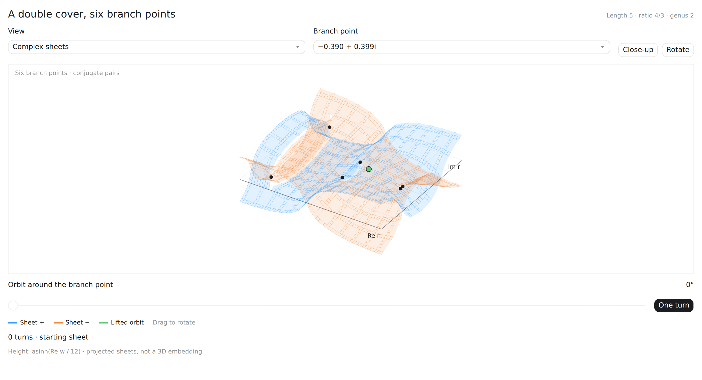
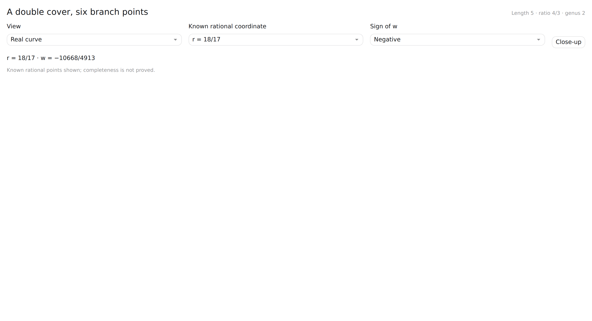
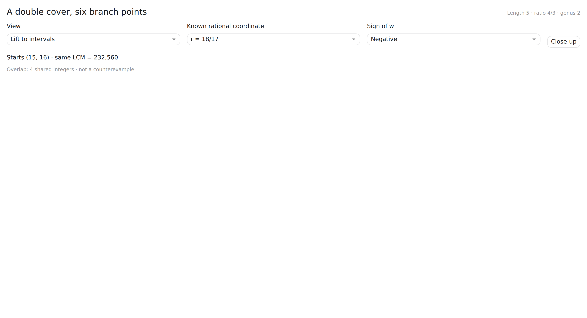

# Erdős 677 Curve Visualisation

Interactive visualisation of the genus-2 curve arising in the investigation of **Erdős Problem 677**, focusing on the length-5, ratio \(4/3\) case.

### [Open the interactive visualisation →](https://kddavis91.github.io/erdos677-curve-visualisation/)

  

## What it shows

The visualisation provides three related views of the curve:

- **Complex sheets** — a rotatable projection of the two-sheeted cover, showing the six branch points and the behaviour of a lifted orbit around a selected branch point.
- **Real curve** — the real locus of the genus-2 curve together with the known rational points used in the investigation.
- **Lift to intervals** — maps a selected rational point back to the corresponding pair of length-5 integer intervals, making the connection to the original Erdős problem explicit.

The branch-point view also allows a loop to be followed continuously around a branch point. After one turn the lift moves to the opposite sheet; after two turns it returns to its starting point.

## Real locus

  

Known rational points are plotted on the two real branches. Their presence is established; the visualisation does **not** claim that the displayed set is complete.

## Lifting back to the interval problem

  

For a selected rational point, the final view reconstructs the corresponding interval starts and compares the two length-5 blocks directly.

This makes it possible to move between the algebraic curve and the original combinatorial formulation rather than treating the curve as an isolated object.

## Interactive controls

The browser version lets you:

- rotate and inspect the complex-sheet projection
- select each conjugate pair of branch points
- follow a lifted orbit through one or two complete turns
- inspect known rational coordinates on the real curve
- switch the sign of \(w\)
- lift rational points back to candidate integer intervals

## Implementation

The visualisation is a self-contained browser application in [`index.html`](index.html). No build process or external data files are required.

---

This repository contains the visualisation only. The wider computational and mathematical investigation of Erdős Problem 677 is maintained separately.
