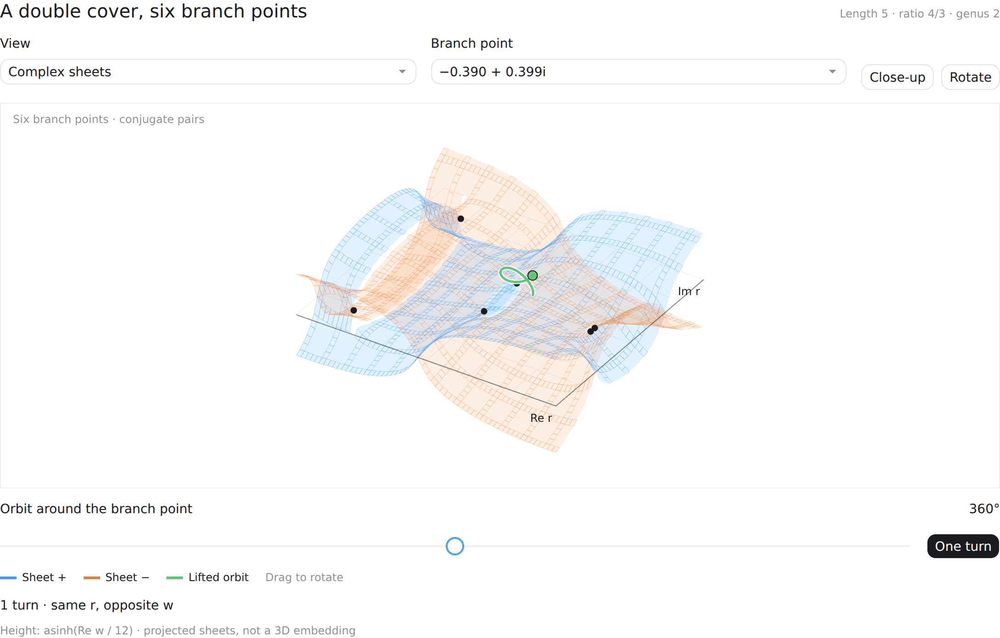
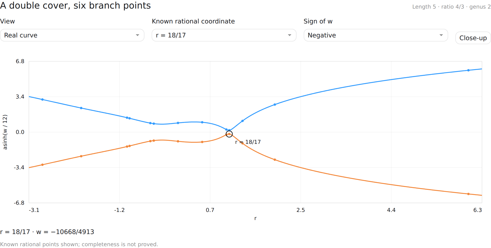
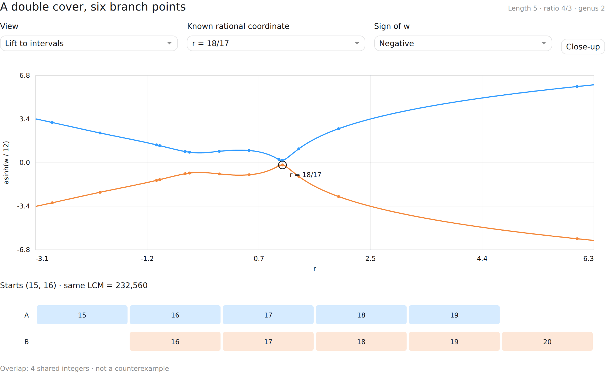
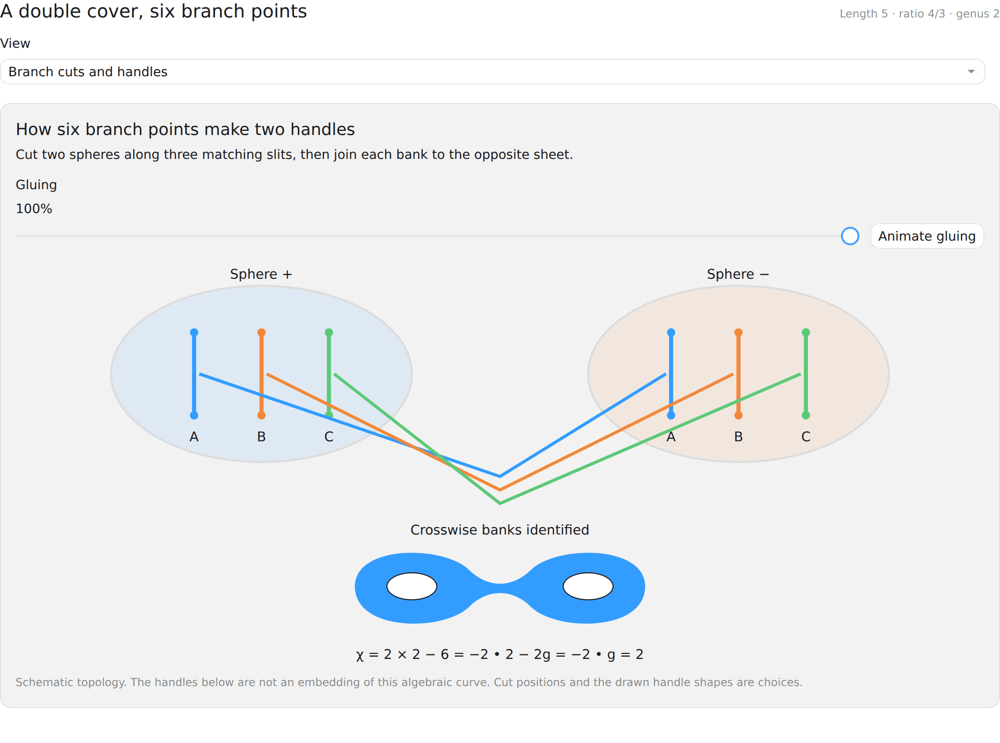
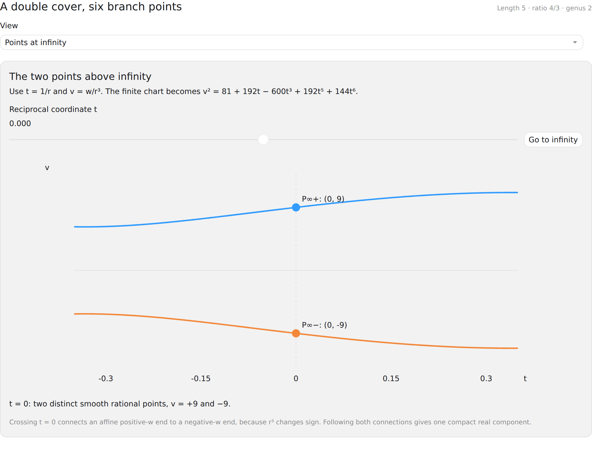
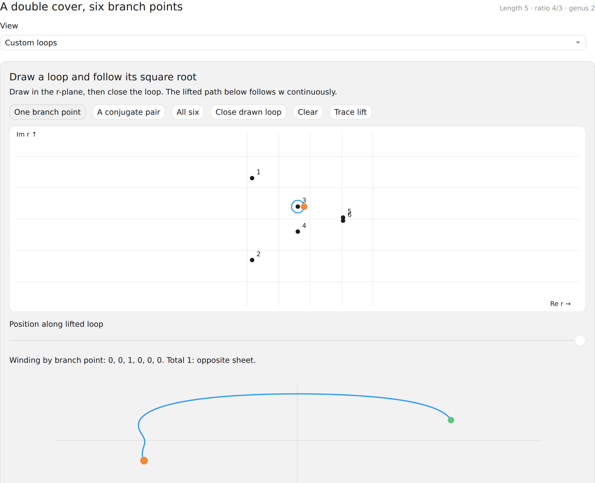
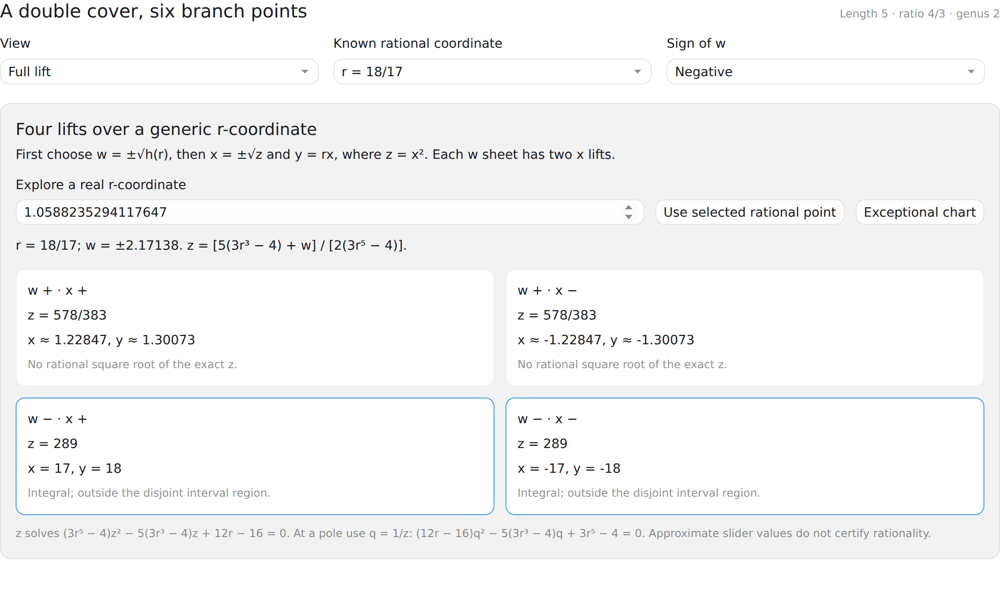
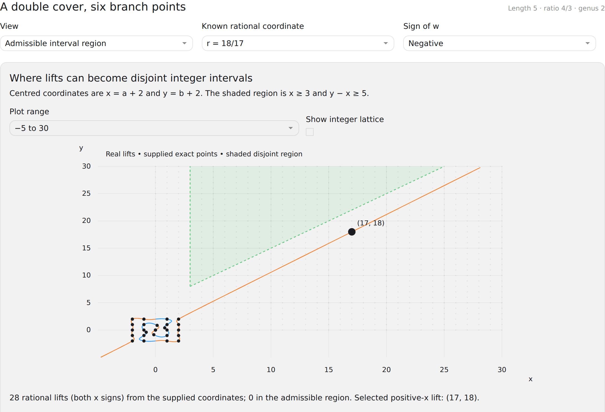

# Erdős 677 Curve Visualisation

Explore the genus-two curve behind the **length-five, product-ratio $4/3$ case** of the repeated-LCM interval problem. Eight interactive views connect its complex sheets, compact geometry and rational points to candidate integer intervals.

**[Open the interactive visualisation →](https://kddavis91.github.io/erdos677-curve-visualisation/)**

*One turn returns to the same base coordinate on the opposite sheet. A second turn closes the lifted path.*

## Choose a view

| View | Explore |
| --- | --- |
| [Complex sheets](#complex-sheets) | Six branch points, a rotatable projection and a continuously lifted orbit. |
| [Real curve](#real-curve) | The real locus and the supplied rational points. |
| [Lift to intervals](#lift-to-intervals) | Exact integer lifts, interval starts, LCMs and overlap. |
| [Branch cuts and handles](#branch-cuts-and-handles) | How two cut spheres glue into a genus-two surface. |
| [Points at infinity](#points-at-infinity) | A reciprocal chart and the connections between the real ends. |
| [Custom loops](#custom-loops) | Draw loops, count winding and follow sheet switching. |
| [Full lift](#full-lift) | Both $w$ sheets and both square-root lifts, including the exceptional chart. |
| [Admissible interval region](#admissible-interval-region) | Real lifts, integer points and the positive disjointness region. |

## The curve and its coordinates

The genus-two quotient is

$$
w^2 = h(r) = 81r^6 + 192r^5 - 600r^3 + 192r + 144.
$$

For intervals starting at $a$ and $b$, use centred coordinates $x=a+2$ and $y=b+2$. The product of five consecutive integers is

$$
P_5(x)=x(x^2-1)(x^2-4).
$$

This case studies $P_5(y)=\tfrac43P_5(x)$. The curve parameter **$r=y/x$ varies**; it is distinct from the fixed product ratio $4/3$.

Writing $z=x^2$ gives

$$
(3r^5-4)z^2-5(3r^3-4)z+12r-16=0,
$$

whose discriminant is $h(r)$. This supplies the bridge from the double cover to interval candidates.

## Complex sheets

Rotate the two projected sheets, select a branch point and use **One turn** or the orbit slider to follow its lifted path. **Close-up** reveals the local behaviour near the selected branch point.

The six branch points occur in three conjugate pairs. The displayed height is `asinh(Re(w) / 12)`; the image is a projection of the complex curve.

## Real curve

Inspect both real branches, choose a rational coordinate, switch the sign of $w$, or select a marker directly. The vertical scale uses `asinh(w / 12)` to keep large values visible.

The markers are supplied rational points. The visualisation does not establish that this set is complete.

## Lift to intervals

For a selected $(r,w)$, the app evaluates

$$
x^2=\frac{5(3r^3-4)+w}{2(3r^5-4)},\qquad y=rx.
$$

It checks integer coordinates and reconstructs $a=x-2$, $b=y-2$, then computes the two LCMs with exact integer arithmetic.

For example, $r=18/17$ on the negative $w$ sheet gives $(x,y)=(17,18)$ and starts $(15,16)$. Both LCMs are **232,560**, but the intervals share four integers. This example shows why an integer lift and equal LCMs still need the disjointness condition.

## Branch cuts and handles

Move the **Gluing** slider or animate the matching of opposite banks. The three slits connect the two sheets into a surface with two handles:

$$
\chi=2\cdot2-6=-2=2-2g,\qquad g=2.
$$

The handle shape is a topological schematic. Its geometry and the chosen cuts are illustrative.

## Points at infinity

The chart $t=1/r$, $v=w/r^3$ makes infinity finite:

$$
v^2=81+192t-600t^3+192t^5+144t^6.
$$

At $t=0$ there are two distinct smooth rational points, $v=\pm9$. Move through zero to see how the affine ends connect. Since $r^3$ changes sign, a positive-$w$ end connects to a negative-$w$ end; together these connections form one compact real component.

## Custom loops

Choose a preset around **one branch point**, **a conjugate pair** or **all six**, or draw a loop directly in the $r$-plane. Releasing the pointer closes a drawn loop. Use **Trace lift** or the position slider to follow $w$ continuously.

The winding readout explains the outcome: an odd total winding swaps sheets, while an even total returns to the starting sheet. The lower plot shows the lifted path in the complex $w$-plane with compressed axes. Loops too close to a branch point are rejected.

## Full lift

Over a generic $r$, choose $w=\pm\sqrt{h(r)}$ and then $x=\pm\sqrt{z}$. The four cards distinguish real, non-real, rational and integral lifts. For supplied rational coordinates, the square-root checks use exact fractions.

Explore other real coordinates numerically, or choose **Exceptional chart** at $3r^5-4=0$. One branch has a finite $z$ limit; the other is described by $q=1/z=0$. The reciprocal equation is

$$
(12r-16)q^2-5(3r^3-4)q+3r^5-4=0.
$$

Numerical coordinates are displayed as approximations and do not certify rationality.

## Admissible interval region

The $(x,y)$ plot shades the necessary region

$$
x\ge3,\qquad y-x\ge5,
$$

which translates to positive starts and disjoint length-five intervals. Switch the plot range or the integer lattice, and use the exact-point table below the plot to inspect individual lifts.

The selected point $(17,18)$ sits below the disjointness boundary. An integer point in the shaded region would still require the exact LCM check.

## Use and scope

Open the [live page](https://kddavis91.github.io/erdos677-curve-visualisation/) and select a view from the menu. The page supports desktop and phone layouts, light and dark themes, and reduced-motion preferences. Preset buttons provide an alternative to drawing custom loops.

The application is contained in [`index.html`](index.html). It needs no build step or external data files. [`scripts/capture-readme.cjs`](scripts/capture-readme.cjs) can reproduce the eight cropped README images at twice the displayed resolution.

This repository focuses on the geometry of one reduction case. The wider investigation remains separate, and the full Erdős 677 problem remains unresolved in that work.
